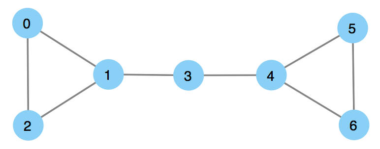

example-graphx
====

This is a repository for [Spark GraphX](http://spark.apache.org/graphx/) code examples implemented in Scala.

### Getting Started

- [ ] Install [sbt](http://www.scala-sbt.org/)
- [ ] Clone this repository
- [ ] Run sbt

```
git clone git@github.com:mogproject/example-graphx.git
cd example-graphx
sbt run
```

### Files

|File |Path|
|-----|----|
|Example edge list|[src/main/resources/edge_list_1.txt](https://github.com/mogproject/example-graphx/blob/master/src/main/resources/edge_list_1.txt)|
|Algorithm: Betweenness centrality|[src/main/scala/Betweenness.scala](https://github.com/mogproject/example-graphx/blob/master/src/main/scala/Betweenness.scala)|
|Main logic|[src/main/scala/Main.scala](https://github.com/mogproject/example-graphx/blob/master/src/main/scala/Main.scala)|

#### Network view: edge_list_1.txt



### Expected output

```
### Loading edge list: src/main/resources/edge_list_1.txt

0 1
0 2
1 2
1 3
3 4
4 5
4 6
5 6

### Degree centrality

Node: 0 -> Degree: 2
Node: 1 -> Degree: 3
Node: 2 -> Degree: 2
Node: 3 -> Degree: 2
Node: 4 -> Degree: 3
Node: 5 -> Degree: 2
Node: 6 -> Degree: 2

### Betweenness centrality

Node: 0 -> Betweenness: 0.0
Node: 1 -> Betweenness: 8.0
Node: 2 -> Betweenness: 0.0
Node: 3 -> Betweenness: 9.0
Node: 4 -> Betweenness: 8.0
Node: 5 -> Betweenness: 0.0
Node: 6 -> Betweenness: 0.0
```
